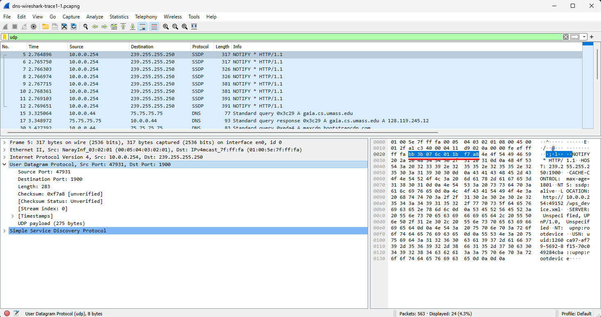

# **Hands On Wireshark TCP and UDP**

| **Nama**                  | **NRP**    |
| ------------------------- | ---------- |
| Rayhan Arvianta Bayuputra | 5025211217 |

Questions can be found in the pdf files at `/assets`. Wireshark captured packet file tcp-wireshark-trace1-1 <a href="http://gaia.cs.umass.edu/wireshark-labs/wireshark-traces-8.1.zip">here</a>

## TCP

### TCP Number 1


```
IP address: 192.168.86.68
Port number: 55639
```

### TCP Number 2


```
IP address: 128.119.245.12
Port number: 80
```


### TCP Number 3


```
Sequence Number (raw): 4236649187
```

### TCP Number 4


```
Sequence Number (raw): 1068969752
```

### TCP Number 5


```
Sequence Number (raw): 4236801228
Payload Bytes: 1385
If the payload data in the TCP segment is 1451 bytes, and the file "alice.txt" is more than 152K bytes (where 1K is typically defined as 1024 bytes), then it's clear that the entire contents of "alice.txt" cannot fit into this single 1448-byte TCP segment.
```

### TCP Number 6


```
a. 0.02404047 s
b. 0.052671 s
c. 0.028624 s
d. 0.028628 s
e. Complex calculation (not required)
```

### TCP Number 7


```
Packet 1: Length = header (32 bytes) + payload (1448 bytes) = 1480 bytes 
Packet 2: Length = header (32 bytes) + payload (1448 bytes) = 1480 bytes  
Packet 3: Length = header (32 bytes) + payload (1448 bytes) = 1480 bytes  
Packet 4: Length = header (32 bytes) + payload (1448 bytes) = 1480 bytes  
```

### TCP Number 8
```
Packet 1: Window = 2058
Packet 2: Window = 2058
Packet 3: Window = 2058
Packet 4: Window = 2058

Minimum amount of available buffer space 2058 bytes. It doesn't throttle because the space used for the data-carrying segments are only 1480 each (less than 2058).
```


### TCP Number 9-14
Complex explanations and calculations, not required.


## UDP

### UDP Number 1


```
application-layer or protocol message: SSDP
Fields: 4
- Source Port: 47931
- Destination Port: 1900
- Length: 283
- Checksum: 0xf7a8
```

### UDP Number 2


```
The total length of the UDP header is 8 bytes, and 2 bytes for each header fields.
```

### UDP Number 3
```
The length fields specifies the number of bytes in the UDP segment (header + data). So since the length of the UDP payload is 275 bytes, and the header is 8 bytes, the total length is 283 (see the image in UDP Number 2).
```

### UDP Number 4
```
The maximum number of bytes that can be included in a UDP payload is (2^16 – 1) bytes plus the header bytes. 
This gives 65535 bytes – 8 bytes = 65527 bytes. 
```

### UDP Number 5
```
The largest possible source port number is (2^16 – 1) = 65535. 
```

### UDP Number 6

```
The IP protocol number for UDP is 17.
```

### UDP Number 7


```
The source port of the UDP packet sent by the host is the same as the 
destination port of the reply packet, and conversely the destination 
port of the UDP packet sent by the host is the same as the source port 
of the reply packet.
```
